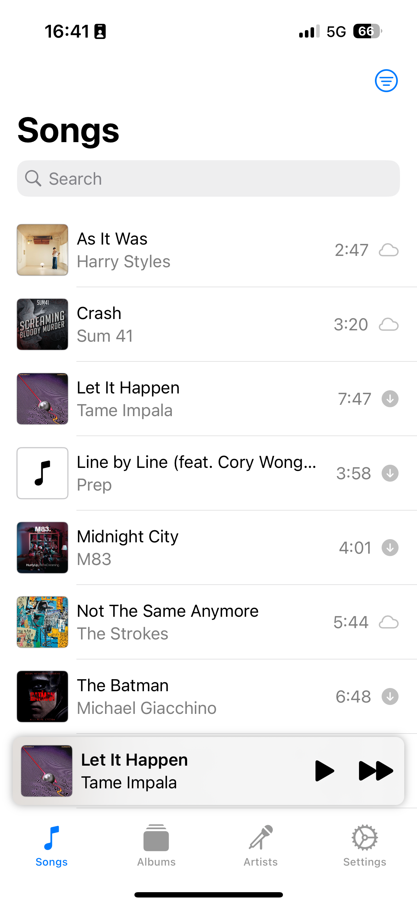
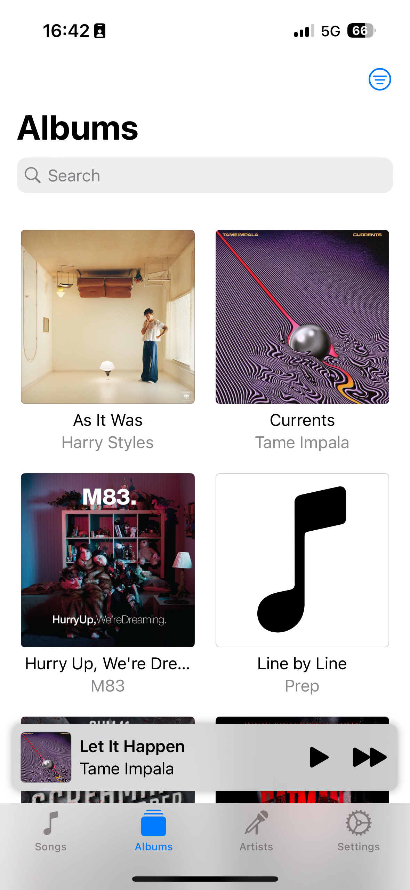
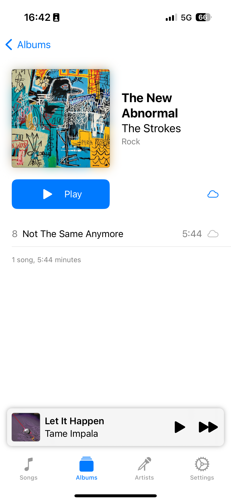
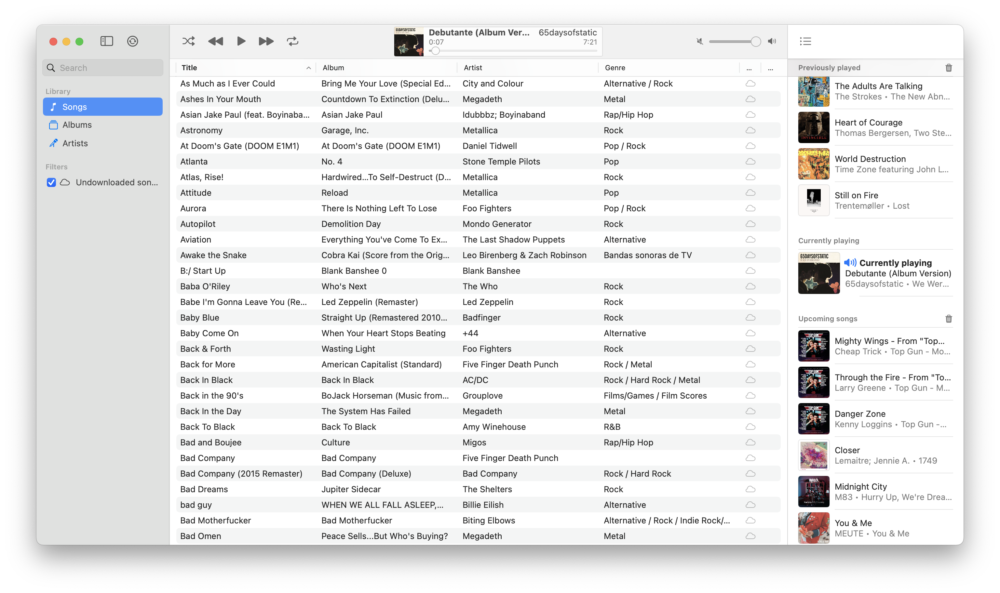
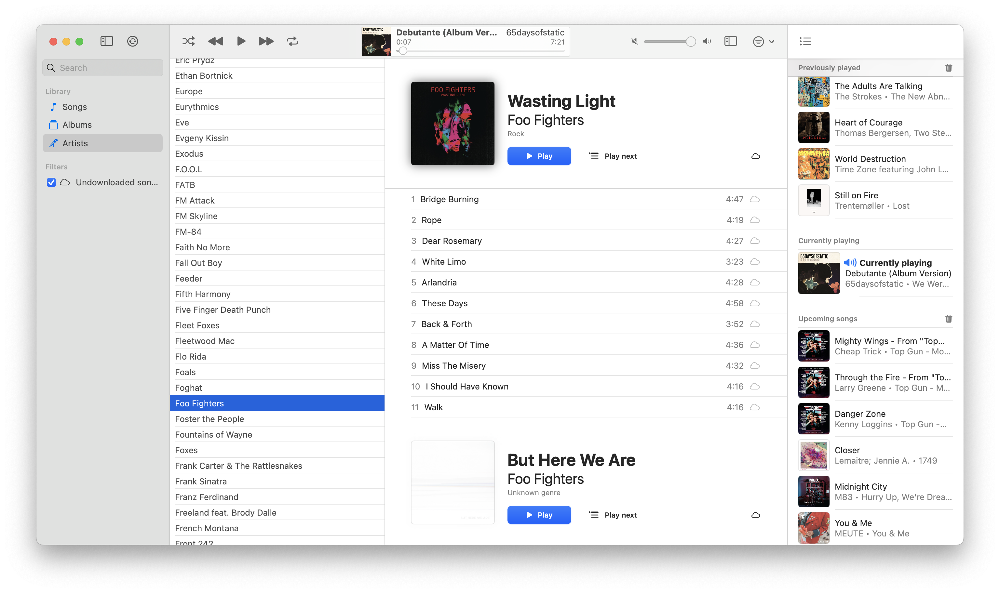

#  Harmony

Unify your music library and play your songs from anywhere.

Currently supports local playback, and streaming from:

* iCloud
* Nextcloud

(more coming)

**Still in alpha!**

    
    
    

    
    

    
    

